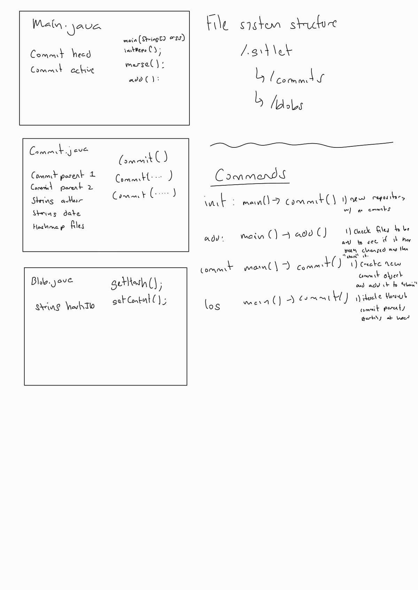

# Gitlet Design Document
author: Paree Hebbar

## Design Document Guidelines

Please use the following format for your Gitlet design document. Your design
document should be written in markdown, a language that allows you to nicely 
format and style a text file. Organize your design document in a way that 
will make it easy for you or a course-staff member to read.  

## 1. Classes and Data Structures

Include here any class definitions. For each class list the instance
variables and static variables (if any). Include a ***brief description***
of each variable and its purpose in the class. Your explanations in
this section should be as concise as possible. Leave the full
explanation to the following sections. You may cut this section short
if you find your document is too wordy.

### Main.java
This class is the entry point of the program. It handles user input and 
support for each command of the program. Handles persistance.

#### Fields
1. Commit head: a reference to the head
2. Commit active: a reference to the active branch

### Commits.java
This class stores important metadata regarding commit and pointers to parent commit
and files being committed. 

#### Fields
1. static final Commit parent: a pointer to the previous commit
2. static final String date: a string storing information regarding the date and time of commit
3. Hashmap files: a mapping of file names to Blob references.

### Blob.java
This class stores contents of a file
#### Fields
1. String hashID: a unique hash id used to reference the file.

## 2. Algorithms

This is where you tell us how your code works. For each class, include
a high-level description of the methods in that class. That is, do not
include a line-by-line breakdown of your code, but something you would
write in a javadoc comment above a method, ***including any edge cases
you are accounting for***. We have read the project spec too, so make
sure you do not repeat or rephrase what is stated there.  This should
be a description of how your code accomplishes what is stated in the
spec.

The length of this section depends on the complexity of the task and
the complexity of your design. However, simple explanations are
preferred. Here are some formatting tips:

* For complex tasks, like determining merge conflicts, we recommend
  that you split the task into parts. Describe your algorithm for each
  part in a separate section. Start with the simplest component and
  build up your design, one piece at a time. For example, your
  algorithms section for Merge Conflicts could have sections for:

   * Checking if a merge is necessary.
   * Determining which files (if any) have a conflict.
   * Representing the conflict in the file.
  
* Try to clearly mark titles or names of classes with white space or
  some other symbols.
### Main.java
1. main(String[] args): This is the starting point of the program. Depending on the user input in args. The main
function makes various different calls to other methods
2. initRepo(): initilaizes new directory /.gitlet for store commit and file data

### Commit.java
Multiple constructors (overloading) to create a new commit object. This class also has methods to handle merging of branches and checking out previous commits.

### Blobs.java
Constructor method that retrieves and stores (in Blob class fields):
1) file name 
2) contents of the file 
3) hashID 

## 3. Persistence

Describe your strategy for ensuring that you don’t lose the state of your program
across multiple runs. Here are some tips for writing this section:

* This section should be structured as a list of all the times you
  will need to record the state of the program or files. For each
  case, you must prove that your design ensures correct behavior. For
  example, explain how you intend to make sure that after we call
       `java gitlet.Main add wug.txt`,
  on the next execution of
       `java gitlet.Main commit -m “modify wug.txt”`, 
  the correct commit will be made.
  
* A good strategy for reasoning about persistence is to identify which
  pieces of data are needed across multiple calls to Gitlet. Then,
  prove that the data remains consistent for all future calls.
  
* This section should also include a description of your .gitlet
  directory and any files or subdirectories you intend on including
  there.
### commit [file]
everytime we are committing a file our Commit object(s) should change and we should write a new data file containing our new commit objects
### merge
merging also entails changing commit object(s) hence requiring the data to be rewritten or updated in the /.gitlet subdirectory

## 4. Design Diagram

Attach a picture of your design diagram illustrating the structure of your
classes and data structures. The design diagram should make it easy to 
visualize the structure and workflow of your program.

